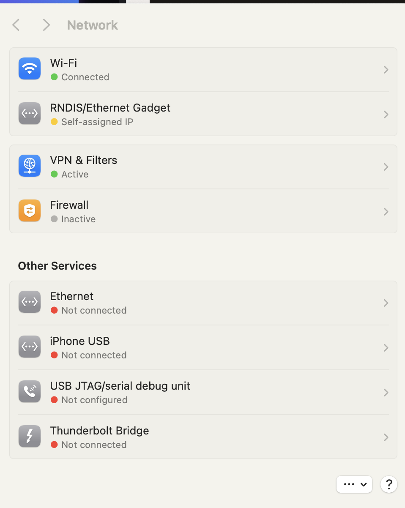
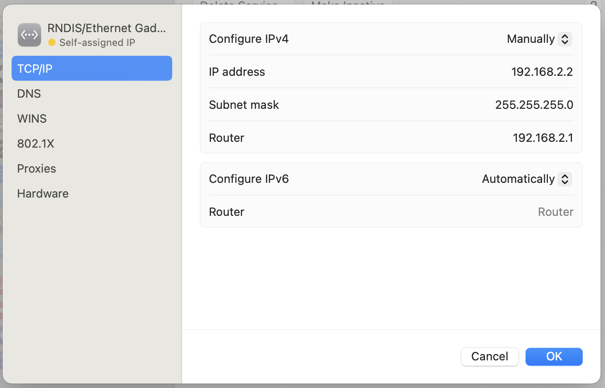
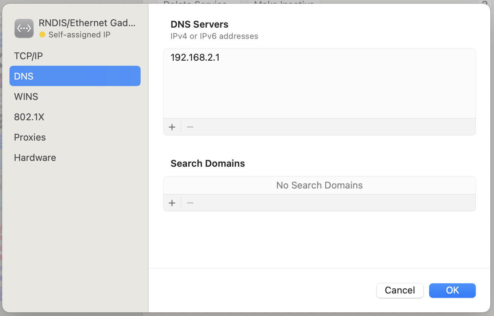

# Raspberry Pi Zero 2 W ConfigFS USB Gadget

This package configures the Raspberry Pi Zero 2 W as a USB gadget through
Linux ConfigFS. It supports:

- CDC ECM Ethernet for macOS and Linux;
- RNDIS Ethernet for Windows;
- optional CDC ACM serial;
- optional export of the real FAT boot partition as USB Mass Storage;
- persistent USB MAC addresses and serial identity;
- an optional USB gateway and optional USB DNS configuration.
- tested on Raspberry Pi OS 64-bit (Trixie) and Kali/Kali PiTails 64-bit (2026.2)

The package uses the existing `ifupdown` boot flow. On the first boot,
an `up` hook attached to `lo` installs the runtime files into the real root
filesystem and starts the service. The hook is then removed automatically.

## Package files

Copy these files to the root of the FAT boot partition:

```text
install-usb-gadget.sh
usb-gadget
usb-gadget.service
usb-gadget.conf
```

`usb-gadget.conf` intentionally remains on the boot partition. It is the
runtime configuration source and is not copied into `/etc`.

## Clean installation

This procedure starts from a freshly flashed RPI linux distro SD card and does not
require SSH access or a previous gadget installation.

### 1. Copy the package to the boot partition

Mount the SD card's FAT boot partition on the host machine. In this example it is
`/Volumes/bootfs` for macOS. Adjust the path for Linux or Windows.

```bash
BOOT=/Volumes/bootfs

cp ./install-usb-gadget.sh "$BOOT/install-usb-gadget.sh"
cp ./usb-gadget "$BOOT/usb-gadget"
cp ./usb-gadget.service "$BOOT/usb-gadget.service"
cp ./usb-gadget.conf "$BOOT/usb-gadget.conf"
```

### 2. Remove legacy gadget boot parameters

Edit `cmdline.txt` and keep it as one line:

```bash
nano "$BOOT/cmdline.txt"
```

Remove old tokens if exists such as:

```text
g_ether
g_ether.host_addr=...
g_ether.dev_addr=...
```

If `modules-load=` contains `g_ether`, remove only that module and leave
`dwc2`, for example:

```text
modules-load=dwc2
```

### 3. Add the first-boot ifupdown hook

Edit the boot-side `interfaces` file:

```bash
nano "$BOOT/interfaces"
```

Ensure the loopback stanza contains this line exactly once:

```text
auto lo
iface lo inet loopback
    up /bin/bash /boot/firmware/install-usb-gadget.sh --offline-firstboot || true
```

Do not add a second `usb0` network stanza. The runtime script creates and
configures the USB Ethernet interface itself. RPI copies the boot-side
`interfaces` file into `/etc/network/interfaces` during boot.

### 4. First boot

Eject the SD card cleanly, insert it into the Pi, and connect the USB data port
to the host computer.

The first boot performs this sequence:

```text
RPI copies boot/interfaces
        |
        |
        v
ifup lo
        |
        v
install-usb-gadget.sh --offline-firstboot
        |
        +-- re-executes from /run so /boot/firmware can be unmounted safely
        +-- installs usb-gadget into /usr/local/sbin
        +-- installs usb-gadget.service into /etc/systemd/system
        +-- removes the first-boot hook from boot/interfaces
        +-- systemctl daemon-reload
        +-- systemctl enable usb-gadget.service
        +-- systemctl start usb-gadget.service
        +-- creates /var/lib/usb-gadget/.offline-firstboot-installed
```

The service is started during this same first boot. No intermediate reboot is
required by the bootstrap.

## Configuration

The main in `usb-gadget.conf` are:

```bash
# ecm for macOS/Linux, rndis for Windows
PROFILE=ecm

ENABLE_ACM=yes

ENABLE_BOOT_STORAGE=yes
BOOT_STORAGE_DEVICE=/dev/mmcblk0p1
BOOT_STORAGE_MOUNT=/boot/firmware
BOOT_STORAGE_RO=no

USB_ADDRESS=192.168.2.3/24
USB_GATEWAY=192.168.2.1

# Optional. Leave empty to preserve the existing DNS configuration.
USB_DNS=
```

`USB_GATEWAY` must be the address of the host computer on the USB network.
If the host uses Internet Sharing, enable it on the host and set this value to
the host's shared-interface address. The gadget replaces the default route
with:

```text
default via USB_GATEWAY dev usb0
```

`USB_DNS` is optional and has no assumed default. If it is set, it may contain
space-separated DNS servers, for example:

```bash
USB_DNS=1.1.1.1
```

If it is empty, the script does not modify the existing DNS configuration.

The service reads `usb-gadget.conf` when it starts. After changing it, restart
the service when the boot partition is available to the Pi:

```bash
sudo systemctl restart usb-gadget.service
```

When `ENABLE_BOOT_STORAGE=yes`, the service unmounts the boot filesystem and
exports its raw block device over USB. In that state, edit the file from the
host's mounted USB storage, eject it cleanly, and then restart the service or
reboot the Pi.

## Host configuration

Configure the host USB Ethernet interface with an address in the same subnet
as `USB_ADDRESS`. For example, if the Pi is `192.168.2.3/24` and the host is
`192.168.2.2`, use:

```text
Host address: 192.168.2.2
Subnet mask:  255.255.255.0
```

The host address must match `USB_GATEWAY` if the Pi should use the USB link for
its default route.

For SSH:

```bash
ssh kali@192.168.2.3
```

Keep the normal host Wi-Fi or Ethernet service configured separately if it is
also providing Internet Sharing.

### Connect via USB on MacOS

1. First boot the Pi with the SD card inserted and the USB cable disconnected. 
   The Pi will boot normally and run the first-boot hook. 
   The Pi will power from the Mac and expose itself as a USB Ethernet (RNDIS/Ethernet Gadget) network interface, and a yellow dot will appear next to the new USB network interface in macOS Network settings to indicate limited or no internet connectivity.
   
     

2. Configure macOS networking
   Once the Pi has booted in gadget mode:
   Open **System Preferences** > **Network**. A new **RNDIS/Ethernet Gadget** interface should appear.
   
   Click **Details** and configure:
   
   - **TCP/IP Tab:**
     
     - Configure IPv4: **Manually**
     
     - IP Address: `192.168.2.2`
     
     - Subnet Mask: `255.255.255.0`
     
     - Router: `192.168.2.1`
       
       
   
   - **DNS Tab:**
     
     - DNS Servers: `192.168.2.1` or `1.1.1.1`
       
       
   
   Now the RNDIS/Ethernet Gadget will appears as connected (green dot)
   
   

3. **Enable Internet Sharing** (Optional) If you want the Pi to have internet access through your Mac, enable **Internet Sharing** in **System Preferences** > **Sharing**. Share your Wi-Fi or Ethernet connection to the **RNDIS/Ethernet Gadget** interface.

4. **Set Network Service Order** Ensure your network service order has **Wi-Fi** or **Ethernet** listed **above** the **RNDIS/Ethernet Gadget** connection. You can adjust this in **System Preferences** > **Network** > **...** > **Set Service Order**.

After configuration, you should be able to SSH to your Pi at `192.168.2.3`.

## Runtime commands

```bash
sudo systemctl status usb-gadget.service
sudo journalctl -u usb-gadget.service --no-pager
sudo systemctl restart usb-gadget.service
sudo systemctl stop usb-gadget.service
```

To check the selected route on the Pi:

```bash
ip -br address
ip route
ip route get 8.8.8.8
```

The last command should select the USB interface and `USB_GATEWAY`.

The persistent identity is stored at:

```text
/var/lib/usb-gadget/identity.conf
```

Do not delete it during normal maintenance. Removing it intentionally causes
new USB MAC addresses and a new serial identity to be generated.

## Boot partition export safety

When `ENABLE_BOOT_STORAGE=yes`, the boot filesystem must not be mounted
read/write simultaneously by the Pi and the USB host. Always eject the boot
volume cleanly from macOS or Linux before rebooting the Pi.

Set:

```bash
ENABLE_BOOT_STORAGE=no
```

if the host must not receive the boot partition as USB Mass Storage.

## Recovering from an incomplete first boot

If the service failed before completing the first boot, inspect the installer
directly:

```bash
sudo bash -x /boot/firmware/install-usb-gadget.sh --offline-firstboot
```

Check the required boot files:

```bash
sudo ls -l /boot/firmware/{install-usb-gadget.sh,usb-gadget,usb-gadget.service,usb-gadget.conf}
```

Check the first-boot hook:

```bash
sudo grep -n 'install-usb-gadget' \
    /boot/firmware/interfaces \
    /etc/network/interfaces
```

The one-shot marker is:

```text
/var/lib/usb-gadget/.offline-firstboot-installed
```

It is created only after the service has started successfully.

## Requirements

The kernel must provide ConfigFS USB gadget support, including the functions
used by the selected configuration:

```text
CONFIG_USB_LIBCOMPOSITE
CONFIG_USB_CONFIGFS
CONFIG_USB_CONFIGFS_ECM
CONFIG_USB_CONFIGFS_RNDIS
CONFIG_USB_CONFIGFS_ACM
CONFIG_USB_CONFIGFS_MASS_STORAGE
```

Check the running kernel with:

```bash
grep -E 'CONFIG_USB_(LIBCOMPOSITE|CONFIGFS|CONFIGFS_ECM|CONFIGFS_RNDIS|CONFIGFS_ACM|CONFIGFS_MASS_STORAGE)' \
    /boot/config-$(uname -r)
```

The Pi's DWC2 controller must be configured for peripheral/device mode. Do
not configure it as a USB host while using this package.
